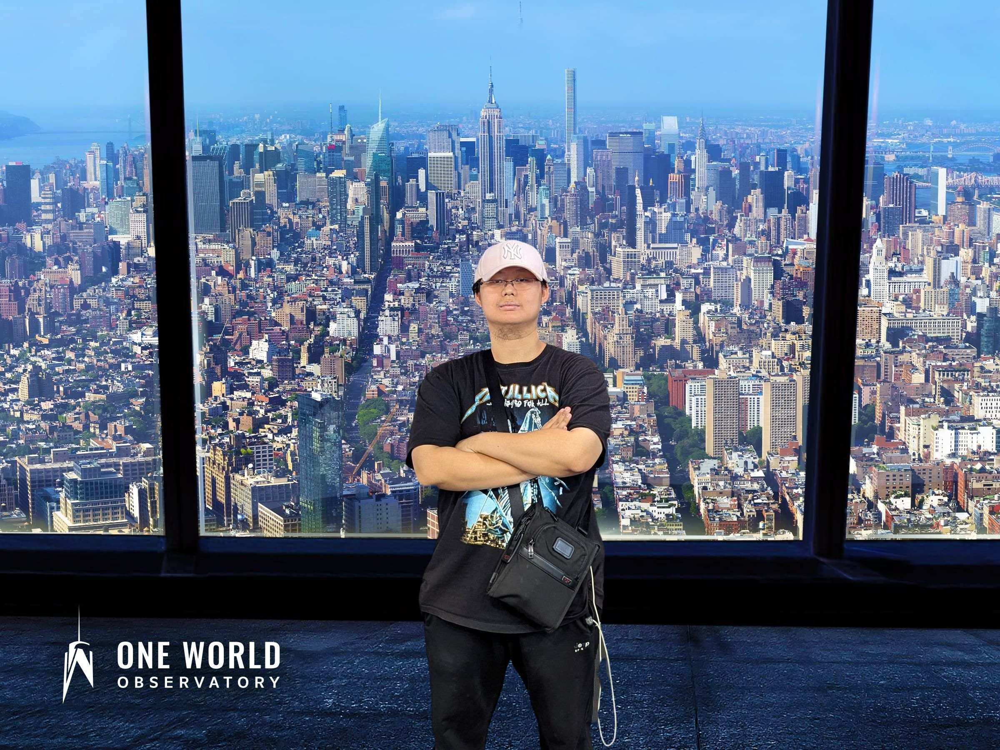
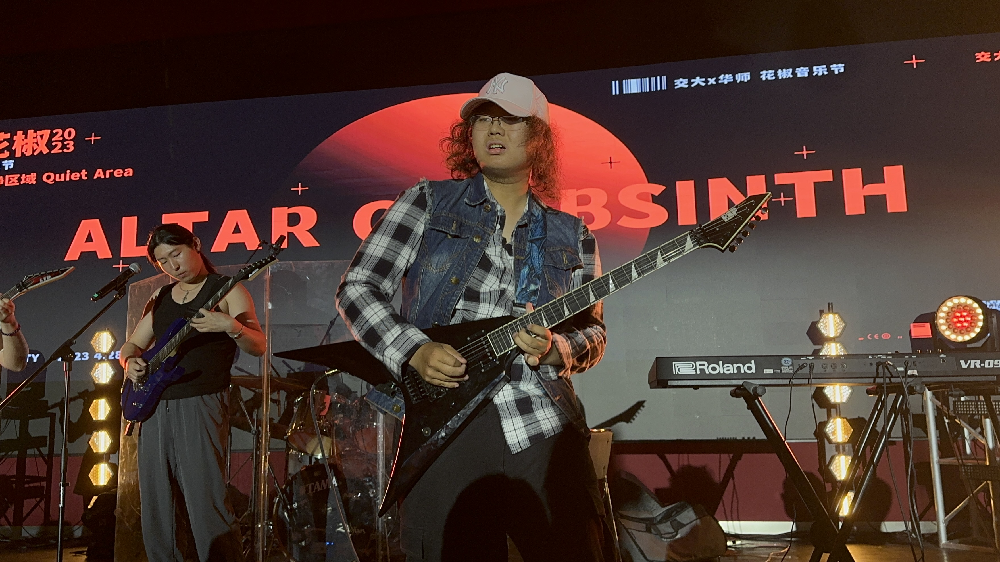

<!-- Fonts -->
<link href="https://fonts.googleapis.com/css2?family=Google+Sans:wght@400;500;700;800&display=swap" rel="stylesheet">

## Welcome

Hi! My name is **Yijun Wang**, and my UNI is **yw4664**. I’m a master student in **Biostatistics** at Columbia University.  

This website was created for **P8105 Homework 4**, and it will serve as my personal homepage for course projects and professional materials.

  
   
  
  

    Illustration of me in anime style — drawn by my incredibly talented gf 💕
  

## About this site

- The **Home** page (this page) gives a brief introduction.  

- The **CV** page contains my academic background and research experiences.  

- You can also find my **GitHub** and **email** links in the navigation bar.

## Research & Interests

I’m interested in:

- **Functional circRNA annotation and analysis**  

- **Statistical genetics and quantitative trait modeling** 

- **Transcriptomic and multi-omics data analysis**

My current research focuses on developing efficient computational tools for identifying and characterizing functional circRNAs, and integrating statistical models with high-throughput sequencing data.

You can check out my GitHub project **[circAnnoPipe](https://github.com/BlooodW/circAnnoPipe)** — 

an integrated pipeline for **circRNA annotation**, including:

- Prediction of **circRNA–miRNA interactions** 

- Identification of **circRNA–RBP binding events** 

- Evaluation of **circRNA translational potential**

## More About Me
Although I’m technically Gen Z, I’ve always felt like **an 80s guy at heart**.

I play **electric guitar** 🎸, mostly 80s **progressive metal**, and spend a lot of time fine-tuning tones and solos.

Here’s my gear:

Here’s me playing:

I also collect **Transformers** 🤖 from the 80s — they’re truly *more than meets the eye*.

And yes, I always wear a **pink hat**, partly because I’m a little bald 😅,  
but mostly because I want it to be my **iconic look**.

## Quick Links
- 📄 [Curriculum Vitae (CV)](cv.html)  
- 💻 [GitHub](https://github.com/BlooodW)  
- ✉️ [Email](mailto:yw4664@cumc.columbia.edu)  
- 🎸 [See Me Playing](https://space.bilibili.com/35001001)

## Contact
If you’d like to get in touch, please reach me via email or GitHub.

